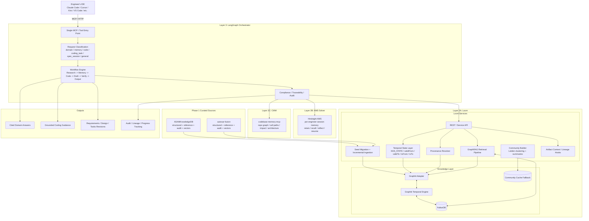
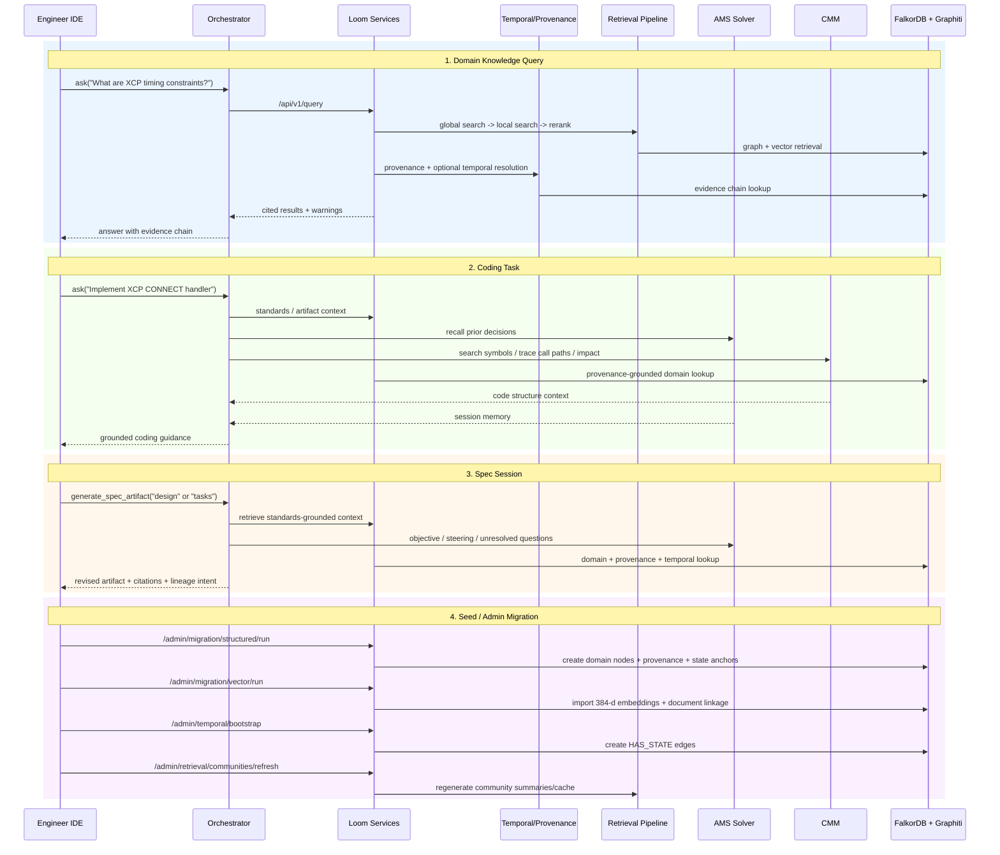
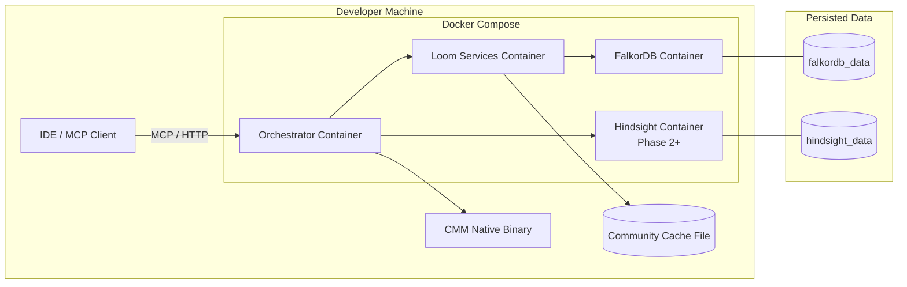
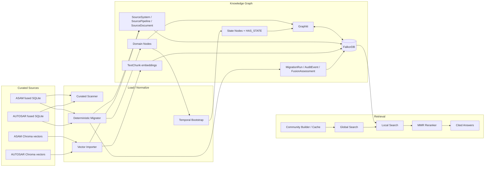

# Loom Architecture Overview

This standalone overview mirrors the architecture now captured in `design.md`, but is formatted for quick reuse in presentations, reviews, and implementation discussions.

## Layered System Overview

## Primary Use-Case Overview

## Deployment and Runtime Topology

## Curated Data Flow

## Notes

- `design.md` remains the main architecture source of truth.
- This file is a reusable snapshot for communication and review.
- The current implementation uses a local cache fallback for community summaries because live `CommunitySummary` writes are still timing out in FalkorDB.
