# Design Document — Loom System

## Overview

Loom is an internal AI-assisted automotive engineering product for four linked workflows:

1. standards-grounded research against ASAM and AUTOSAR knowledge
2. spec-session authoring for `requirements.md`, `design.md`, and `tasks.md`
3. development execution with code-aware, memory-aware agent workflows
4. novice onboarding, traceability review, and development-journey visibility through a Loom-native portal

The portal is a product surface layered on top of the existing services and orchestrator. It is not a replacement for LangGraph, FalkorDB, AMS, or CMM. Those systems remain the execution and storage layers.

Phase 1 seeds Loom from two curated fused source systems:

- `tools/ASAMKnowledgeDB` for ASAM knowledge
- `tools/autosar-fusion` for AUTOSAR, virtual ECU, FMI, SSP, DCP, FIBEX, and related knowledge

Those curated sources are the Phase 1 system of record for migration. They preserve upstream lineage from `mistral_azrouter`, `docling_kimi25`, `virtualECU_text_ingestion`, and `cleanup_fix`, but they do not imply that every raw source file on disk has already been processed. Supplementary raw documents remain future ingestion scope.

The system is designed for 2-3 engineers initially, scaling to 10+, with Windows laptops as the primary engineer platform and macOS used for admin and development oversight.

### Design Rationale

- Curated seed sources first: Phase 1 migrates the two verified fused databases, not the historical pre-fusion pipelines.
- Graphiti is required: temporal reasoning and contradiction-safe state history are implemented with Graphiti on top of FalkorDB, not a parallel custom temporal system.
- Single MCP entry point: engineers should configure one orchestrator, not juggle multiple MCP servers manually.
- Research before output: all coding and spec outputs must be grounded in retrieved knowledge, active steering, and relevant session memory.
- Spec sessions are first-class: Loom is not only a coding assistant. It must also help produce and maintain formal project artifacts.
- Local-first memory: AMS remains per engineer and preserves objective continuity, steering, and transcript auditability.
- Code structure is additive: CMM is a bolt-on capability used when code understanding is needed, not a replacement for Loom or AMS.
- Provenance over convenience: migrated facts must retain source system, source pipeline, source document, confidence, and fusion audit history.
- Product surface decoupled from runtime: the novice-facing dashboard and traceability UX should evolve as a separate web application that consumes existing APIs rather than being embedded inside LangGraph.

---

## Architecture

### System Architecture Diagram

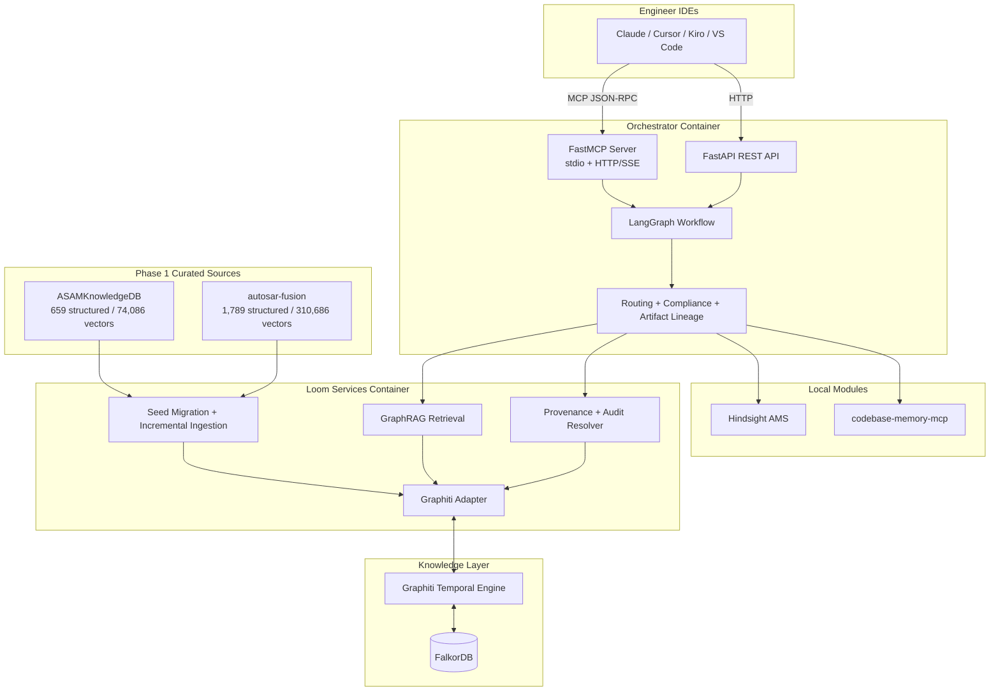

### Layered System Overview

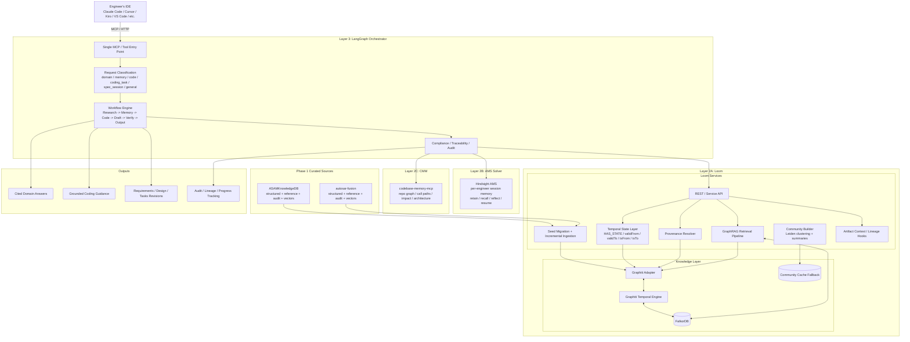

### Loom Portal UX Surface

The Loom portal is a separate web application that sits above the existing runtime. It provides onboarding, answer traceability, progress visibility, and external-tool launch points while keeping LangGraph as the orchestration runtime and Loom Services as the source of truth for knowledge and provenance.

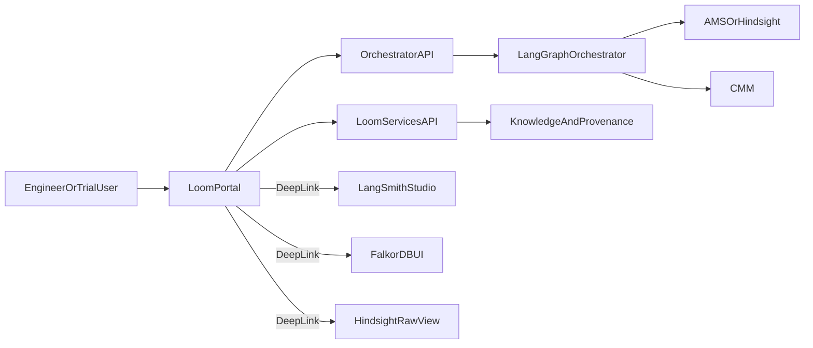

Portal defaults:

- answer-first explanations before raw traces or internal IDs
- progressive disclosure from summary to evidence to native-tool deep links
- manual traceability operations for users who want to search by query, node, audit, artifact, project, or objective
- no duplication of retrieval, memory, provenance, or code-impact business logic in the UI tier

### Primary Use-Case Overview

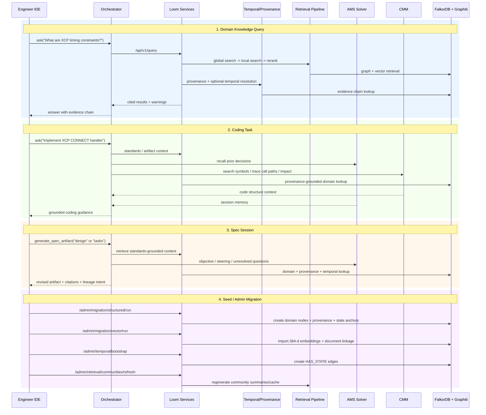

### Deployment Architecture

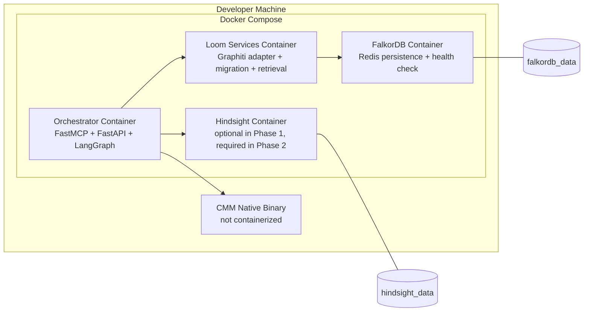

### Phase Boundaries

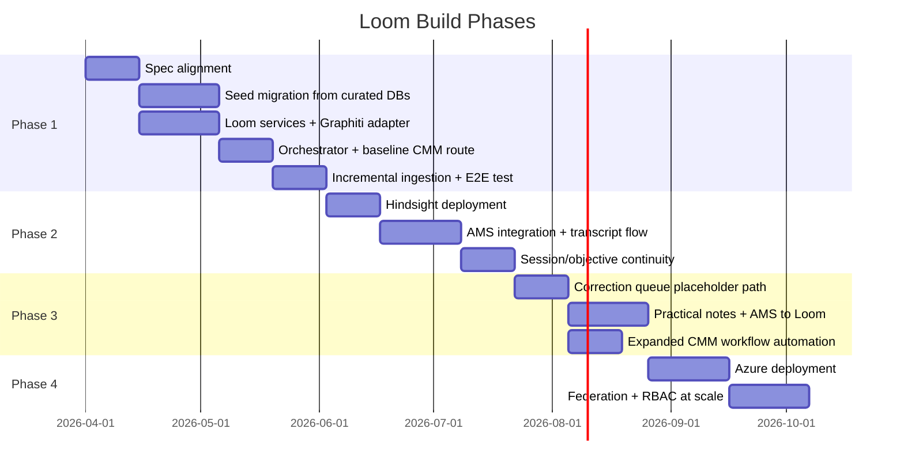

### Seed Migration Boundary

Phase 1 seed migration is intentionally narrow:

- Migrate `tools/ASAMKnowledgeDB` as the final ASAM curated source.
- Migrate `tools/autosar-fusion` as the final AUTOSAR curated source.
- Preserve upstream fusion and cleanup provenance from those systems.
- Do not re-run historical pre-fusion ingestion as a prerequisite for Phase 1.
- Treat supplementary raw AUTOSAR PDFs and other unprocessed sources as future incremental ingestion inputs.

---

## Components and Interfaces

### Module 1: Loom (FalkorDB + Graphiti)

Loom is the centralized standards-grounding layer. It stores normalized ASAM and AUTOSAR domain entities, provenance, temporal state, retrieved context, and artifact lineage links needed for spec sessions and development workflows.

#### Responsibilities

- Normalize the two curated source systems into a single graph.
- Use Graphiti plus FalkorDB for temporal entity and fact management.
- Expose GraphRAG retrieval with provenance and time-aware filtering.
- Preserve fusion audits, cleanup decisions, and migration reports.
- Support incremental ingestion for future raw documents.
- Support artifact lineage links between retrieved facts and generated project artifacts.

#### External Interface

```python
class LoomService:
    async def loom_query(self, query: str, filters: dict | None = None) -> dict:
        """Natural language query with evidence chains and temporal awareness."""

    async def loom_search(self, query: str, top_k: int = 10) -> list[dict]:
        """Direct search over graph and vectors."""

    async def loom_provenance(self, node_id: str) -> dict:
        """Resolve full provenance chain, fusion history, and migration lineage."""

    async def loom_temporal_query(self, query: str, valid_at: str | None = None) -> dict:
        """Query the graph as-of a specific valid time."""

    async def loom_ingest(self, source_path: str, source_kind: str) -> dict:
        """Incrementally ingest new source material into the graph."""

    async def loom_artifact_context(self, query: str, artifact_type: str) -> dict:
        """Retrieve standards context tuned for requirements, design, or tasks generation."""
```

#### Internal Components

```text
loom/
├── services/
│   ├── mcp_server.py
│   ├── rest_api.py
│   └── auth.py
├── graph/
│   ├── graphiti_adapter.py
│   ├── schema.py
│   ├── provenance.py
│   └── identities.py
├── retrieval/
│   ├── global_search.py
│   ├── local_search.py
│   ├── reranker.py
│   └── pipeline.py
├── migration/
│   ├── asamknowledgedb.py
│   ├── autosar_fusion.py
│   ├── vector_import.py
│   └── report.py
├── ingestion/
│   ├── loader.py
│   ├── validation.py
│   ├── graph_loader.py
│   └── community.py
└── artifacts/
    ├── lineage.py
    └── revisions.py
```

#### Graphiti Integration Boundary

Graphiti is mandatory and owns the temporal reasoning layer. The boundary is:

- Graphiti owns temporal fact representation, contradiction-safe updates, and time-aware retrieval primitives.
- FalkorDB remains the backing graph store and vector search substrate.
- Custom Loom code owns source normalization, stable IDs, provenance wiring, community summaries, curated-source migration, and artifact lineage.
- Loom does not implement a second competing temporal engine alongside Graphiti.

#### GraphRAG Retrieval Pipeline

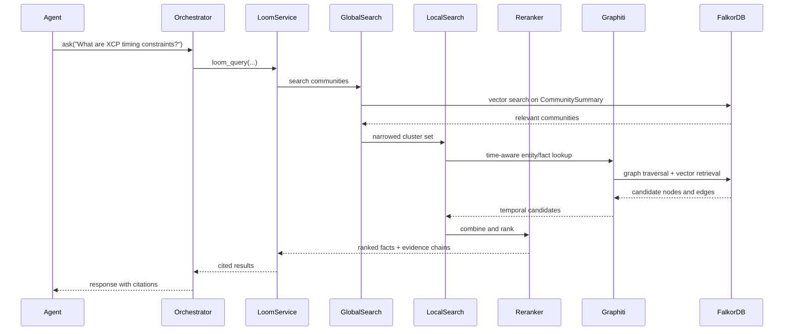

### Module 2: AMS Solver (Hindsight Integration)

AMS is the local per-engineer memory layer. It preserves objective continuity, permanent steering, transcript auditability, and compact resume context across many sessions.

#### Responsibilities

- Retain structured memories tied to project and objective.
- Preserve raw transcript text or transcript references for audit and debugging.
- Maintain permanent steering commands that survive context compression.
- Resume objectives within a bounded token budget.
- Seed session context from project steering files and progress trackers.

#### External Interface

```python
class AMSTools:
    async def ams_retain(self, text: str, session_id: str, project_id: str, objective_id: str) -> dict:
        """Store structured memory and transcript references."""

    async def ams_recall(self, query: str, objective_id: str | None = None) -> list[dict]:
        """Recall relevant memories."""

    async def ams_reflect(self, question: str, objective_id: str | None = None) -> dict:
        """Synthesize across recalled memories."""

    async def ams_resume(self, objective_id: str, token_budget: int = 2000) -> dict:
        """Return bounded resume context."""

    async def ams_store_steering(self, command: str, objective_id: str) -> dict:
        """Persist permanent steering commands."""

    async def ams_seed_from_project(self, steering_paths: list[str], progress_path: str) -> dict:
        """Bootstrap memory from project steering and progress files."""
```

#### Session Relationship Model

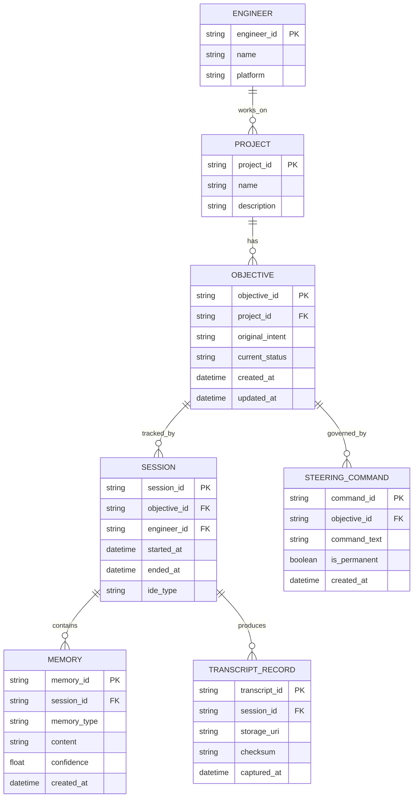

#### Steering and Progress Seeding

At session start, AMS should ingest or refresh:

- `.kiro/steering/loom-core.md`
- `.kiro/steering/loom-progress.md`
- project-specific steering or rule files when present

This seeding does not replace transcript memory. It supplements it with current project rules and current handoff state.

### Module 3: LangGraph Orchestrator

The orchestrator is the single MCP entry point. It classifies requests, coordinates module calls, verifies outputs, and preserves lineage between the request, the evidence consulted, and the generated response or artifact.

#### Responsibilities

- Provide a single MCP surface for IDEs.
- Route requests to Loom, AMS, and CMM.
- Enforce research-before-output policy.
- Coordinate spec-session artifact generation and update flows.
- Pass through evidence chains, session identity, and audit metadata.

#### External Interface

```python
class OrchestratorTools:
    async def ask(self, query: str) -> dict:
        """Main entry point for research, coding, and spec workflows."""

    async def search_knowledge(self, query: str, filters: dict | None = None) -> list[dict]:
        """Direct knowledge search."""

    async def search_code(self, query: str) -> list[dict]:
        """Direct CMM search."""

    async def save_memory(self, text: str, tags: list[str] | None = None) -> dict:
        """Persist session memory."""

    async def resume_session(self, objective_id: str | None = None) -> dict:
        """Retrieve resume context."""

    async def generate_spec_artifact(self, artifact_type: str, prompt: str, target_path: str) -> dict:
        """Generate grounded requirements, design, or tasks content."""

    async def update_spec_artifact(self, artifact_type: str, target_path: str, change_request: str) -> dict:
        """Revise an existing artifact with preserved lineage."""
```

#### LangGraph State Machine

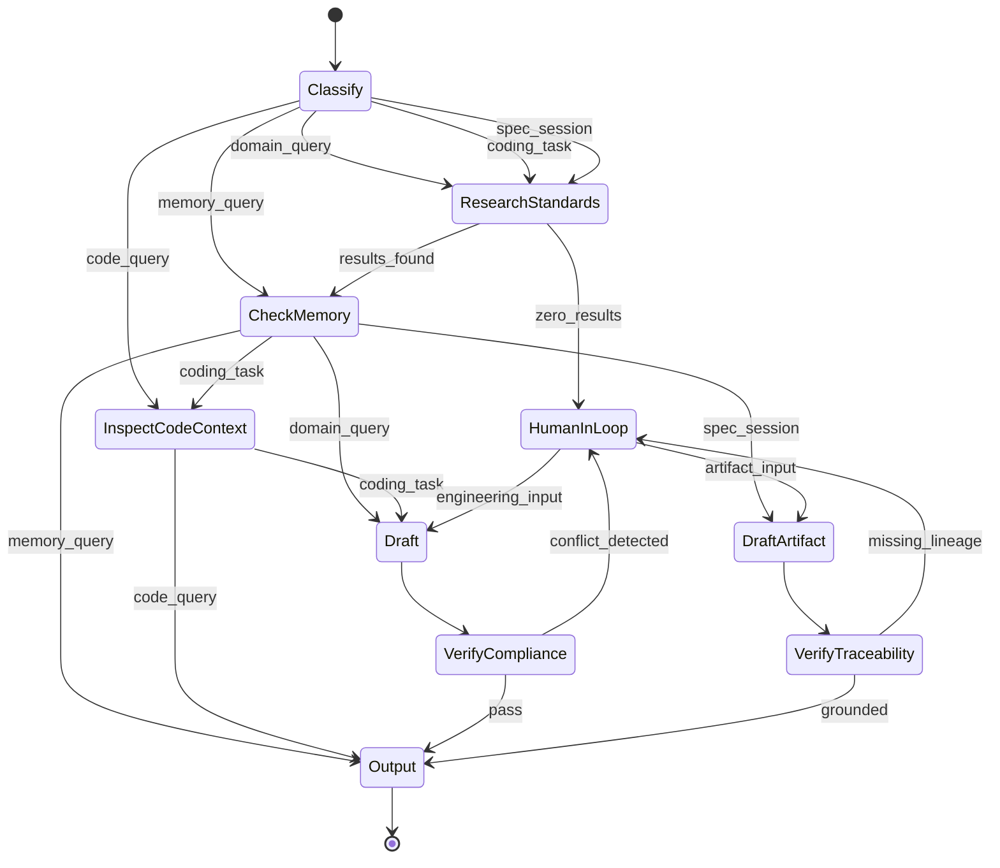

#### Query Classification Logic

| Query Pattern | Route | Example |
|---|---|---|
| Domain knowledge | Loom -> AMS -> Draft -> Verify | "What are XCP timing constraints?" |
| Session memory / progress | AMS only | "What did we decide about the migration schema?" |
| Code structure / impact | CMM only | "What calls the ingest function?" |
| Coding task | Loom -> AMS -> CMM -> Draft -> Verify | "Implement the XCP command handler" |
| Spec session | Loom -> AMS -> DraftArtifact -> VerifyTraceability | "Update the design doc to match the requirements" |
| General | pass-through or ask for scope | "How do I write a Python decorator?" |

#### Spec Session Workflow

A spec session is a first-class orchestrator path:

1. Read active objective, steering, and progress context.
2. Retrieve relevant standards facts and evidence chains from Loom.
3. Retrieve relevant prior decisions and open questions from AMS.
4. Draft or revise the target artifact.
5. Verify that the artifact revision keeps citations, lineage, and unresolved gaps explicit.
6. Persist lineage links between the artifact revision, the objective, the session, and the evidence used.

### Module 4: CMM (Codebase Memory MCP)

CMM is a bolt-on code structure module used when a request needs repository-aware reasoning.

#### Tools Available via Orchestrator

| Tool | Purpose |
|---|---|
| `search_graph` | Find functions, classes, variables, and files by pattern |
| `trace_call_path` | Trace call chains and dependencies |
| `detect_changes` | Map diffs to affected symbols and risk |
| `query_graph` | Run structured code-graph queries |
| `get_architecture` | Summarize indexed repository structure |
| `get_code_snippet` | Fetch source by qualified name |
| `search_code` | Text search enriched by code graph context |

#### Phase 1 Boundary

Phase 1 includes baseline CMM integration for code search and coding-task grounding. Later phases can expand CMM usage for feedback loops, change impact automation, and repository-wide coordination.

### Product Surface: Loom Portal

The Loom portal is a dedicated product surface for novice onboarding, guided traceability, progress review, and external-tool launch paths.

#### Responsibilities

- Provide a first-run wizard for IDE setup, connectivity checks, and guided examples.
- Expose an answer-level traceability view that combines knowledge, memory, code, workflow, and audit context.
- Render a development journey dashboard grouped by `project_id` and `objective_id`.
- Offer context-aware deep links into FalkorDB UI, LangSmith Studio, Hindsight raw views, and any CMM-native UI that becomes available.
- Keep the UI readable for novice users with plain-language labels and expandable advanced detail.

#### External Interface

```typescript
type PortalRoute = "/onboarding" | "/trace" | "/journey" | "/launchpad"

interface PortalDataClient {
  getTraceabilityEnvelope(input: TraceabilityLookup): Promise<TraceabilityEnvelope>
  getDashboardOverview(projectId: string, objectiveId?: string): Promise<DashboardOverview>
  getJourney(projectId: string, objectiveId?: string): Promise<JourneyEvent[]>
  getIntegrationLinks(input: TraceabilityLookup): Promise<IntegrationLink[]>
}
```

#### Recommended Implementation Direction

- `Next.js` for the application shell, routing, and deployment flexibility.
- `shadcn/ui` for open-code, accessible UI primitives that are easy to adapt to Loom language and workflows.
- `TanStack Query` for async server-state, polling, caching, and mutation orchestration.
- Deep-link first integration strategy for third-party UIs in v1; embedding remains optional later work.

### Inter-Module Communication

#### Coding Task Flow

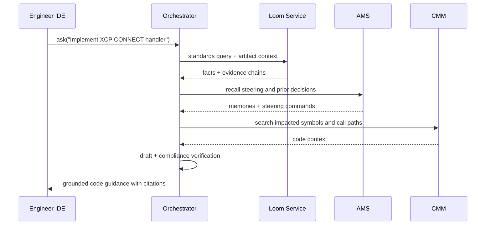

#### Spec Session Flow

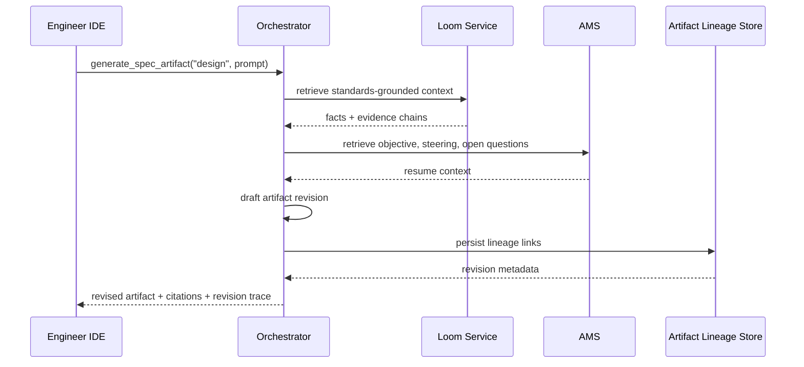

### REST API Endpoints

```text
# Existing runtime endpoints
POST   /api/v1/ask
POST   /api/v1/search/knowledge
POST   /api/v1/search/code
POST   /api/v1/search/code/impact
POST   /api/v1/memory/retain
POST   /api/v1/memory/recall
POST   /api/v1/memory/reflect
POST   /api/v1/memory/promote
POST   /api/v1/session/resume
POST   /api/v1/spec/generate
POST   /api/v1/spec/update
POST   /api/v1/spec/audit
POST   /api/v1/query
POST   /api/v1/search
POST   /api/v1/temporal/query
POST   /api/v1/ingest
POST   /api/v1/ingest/validate
GET    /api/v1/node/{id}/provenance
GET    /api/v1/diagnostics
GET    /api/v1/metrics
GET    /api/v1/health
GET    /api/v1/health/{service}

# Planned aggregation endpoints for the Loom portal
POST   /api/v1/trace/explain
GET    /api/v1/dashboard/overview
GET    /api/v1/dashboard/journey
GET    /api/v1/integrations/links
```

All REST endpoints require authentication. Engineers have read-only access to Loom and write access to their own AMS scope. Admin has Loom write access. The planned portal aggregation endpoints combine source-of-truth data from the existing services rather than replacing them.

---

## Data Models

### Curated Source System Model

Phase 1 starts from two curated fused databases, not the older raw pipelines.

| Source System | Role in Phase 1 | Structured Rows | Vectors | Additional Assets | Provenance Notes |
|---|---|---:|---:|---|---|
| `tools/ASAMKnowledgeDB` | Final ASAM seed source | 659 | 74,086 | 1,956 raw Docling tables, `comparison_report`, `fusion_log` | Preserves `mistral_azrouter` and `docling_kimi25` lineage |
| `tools/autosar-fusion` | Final AUTOSAR seed source | 1,789 post-cleanup | 310,686 | 31,613 Docling reference tables, `comparison_report`, `fusion_log`, cleanup outputs | Preserves `virtualECU_text_ingestion`, `docling_kimi25`, and `cleanup_fix` lineage |

#### Source-Specific Notes

- `ASAMKnowledgeDB` already encodes compare-and-merge history for structured ASAM facts.
- `autosar-fusion` already encodes baseline rows, Kimi enrichment, and cleanup changes.
- AUTOSAR vectors are copied forward from the virtualECU vector store and tagged with inherited provenance, not regenerated by Kimi.
- Supplementary raw AUTOSAR documents still exist on disk and can be ingested later via the incremental pipeline.

### FalkorDB + Graphiti Graph Schema

#### Node Families

```cypher
// Provenance and audit
(:SourceSystem {id, name, path, source_kind})
(:SourcePipeline {id, name, parent_system})
(:SourceDocument {id, filename, page, section, checksum})
(:FusionAssessment {id, quality, recommendation, created_at})
(:MigrationRun {id, source_system, started_at, completed_at, status})

// Domain identity nodes
(:Standard {id, name, organization, version})
(:Protocol {id, name, protocol_type, standard_id})
(:Requirement {id, identifier, title, standard_id})
(:Module {id, name, module_type, standard_id})
(:Interface {id, name, interface_type, standard_id})
(:Concept {id, name, concept_type, standard_id})

// Content nodes
(:Command {id, name, code, description, embedding})
(:ErrorCode {id, name, code, description, embedding})
(:Parameter {id, name, subtype, description, embedding})
(:Table {id, caption, markdown_content, embedding})
(:TextChunk {id, content, heading_path, embedding})
(:CommunitySummary {id, level, summary, embedding})
(:PracticalNote {id, note_type, content, embedding})

// Temporal state nodes
(:StandardState {id, status, quality_grade, version})
(:ProtocolState {id, status, version})
(:ModuleState {id, status, variant})
(:RequirementState {id, status, version})

// Artifact lineage nodes
(:Artifact {id, artifact_type, path, objective_id})
(:ArtifactRevision {id, artifact_id, revision_number, session_id, engineer_id, created_at})
```

#### Relationship Families

```cypher
// Domain structure
(:Standard)-[:DEFINES]->(:Protocol)
(:Standard)-[:DEFINES]->(:Requirement)
(:Standard)-[:DEFINES]->(:Module)
(:Protocol)-[:DEFINES]->(:Command)
(:Protocol)-[:DEFINES]->(:ErrorCode)
(:Protocol)-[:DEFINES]->(:Parameter)
(:Requirement)-[:CONSTRAINS]->(:Protocol)
(:Requirement)-[:CONSTRAINS]->(:Module)
(:Interface)-[:PART_OF]->(:Standard)
(:Concept)-[:PART_OF]->(:Standard)
(:Table)-[:PART_OF]->(:Standard)
(:TextChunk)-[:PART_OF]->(:Standard)
(:CommunitySummary)-[:MEMBER_OF]->(:CommunitySummary)

// Temporal state
(:Standard)-[:HAS_STATE {validFrom, validTo, txFrom, txTo}]->(:StandardState)
(:Protocol)-[:HAS_STATE {validFrom, validTo, txFrom, txTo}]->(:ProtocolState)
(:Module)-[:HAS_STATE {validFrom, validTo, txFrom, txTo}]->(:ModuleState)
(:Requirement)-[:HAS_STATE {validFrom, validTo, txFrom, txTo}]->(:RequirementState)

// Provenance and audit
(:Command)-[:PROVENANCE {confidence, extraction_date}]->(:SourceDocument)
(:ErrorCode)-[:PROVENANCE {confidence, extraction_date}]->(:SourceDocument)
(:Parameter)-[:PROVENANCE {confidence, extraction_date}]->(:SourceDocument)
(:Table)-[:PROVENANCE {confidence, extraction_date}]->(:SourceDocument)
(:TextChunk)-[:PROVENANCE {confidence, extraction_date}]->(:SourceDocument)
(:SourceDocument)-[:EXTRACTED_BY]->(:SourcePipeline)
(:SourcePipeline)-[:BELONGS_TO]->(:SourceSystem)
(:Command)-[:ASSESSED_BY]->(:FusionAssessment)
(:Parameter)-[:ASSESSED_BY]->(:FusionAssessment)
(:SourceDocument)-[:MIGRATED_IN]->(:MigrationRun)

// Artifact lineage
(:Artifact)-[:HAS_REVISION]->(:ArtifactRevision)
(:ArtifactRevision)-[:SUPPORTED_BY]->(:Command)
(:ArtifactRevision)-[:SUPPORTED_BY]->(:Requirement)
(:ArtifactRevision)-[:SUPPORTED_BY]->(:Table)
(:ArtifactRevision)-[:SUPPORTED_BY]->(:TextChunk)
(:ArtifactRevision)-[:REVISED_FROM]->(:ArtifactRevision)
```

#### Vector Index Configuration

```cypher
CREATE VECTOR INDEX FOR (c:Command) ON (c.embedding)
  OPTIONS {dimension: 384, similarityFunction: 'cosine'}
CREATE VECTOR INDEX FOR (e:ErrorCode) ON (e.embedding)
  OPTIONS {dimension: 384, similarityFunction: 'cosine'}
CREATE VECTOR INDEX FOR (p:Parameter) ON (p.embedding)
  OPTIONS {dimension: 384, similarityFunction: 'cosine'}
CREATE VECTOR INDEX FOR (t:Table) ON (t.embedding)
  OPTIONS {dimension: 384, similarityFunction: 'cosine'}
CREATE VECTOR INDEX FOR (tc:TextChunk) ON (tc.embedding)
  OPTIONS {dimension: 384, similarityFunction: 'cosine'}
CREATE VECTOR INDEX FOR (cs:CommunitySummary) ON (cs.embedding)
  OPTIONS {dimension: 384, similarityFunction: 'cosine'}
CREATE VECTOR INDEX FOR (pn:PracticalNote) ON (pn.embedding)
  OPTIONS {dimension: 384, similarityFunction: 'cosine'}
```

### Provenance and Audit Model

Every migrated fact should be resolvable through this chain:

```text
Fact node
  -> SourceDocument
  -> SourcePipeline
  -> SourceSystem
  -> FusionAssessment (when available)
  -> MigrationRun
```

Additional rules:

- `comparison_report` rows become `FusionAssessment` nodes or equivalent audit attachments.
- `fusion_log` rows become migration audit events tied to `MigrationRun`.
- Cleanup decisions from `autosar-fusion` are preserved as audit metadata, not silently flattened away.
- Evidence chains returned to users should resolve through the domain node to the original source document and source pipeline.

### Source-to-Graph Migration Mapping

#### ASAMKnowledgeDB Mapping

| Source Table / Asset | Target Graph Representation | Notes |
|---|---|---|
| `xcp_commands` | `:Command` | Link to `:Protocol` for XCP |
| `xcp_errors` | `:ErrorCode` | Link to XCP protocol |
| `xcp_events` | `:Concept` with `concept_type="xcp_event"` | Preserve event semantics without flattening into errors |
| `mdf_block_types` | `:Parameter` with `subtype="mdf_block"` | Link to MDF standard or protocol |
| `mdf_channel_types` | `:Parameter` with `subtype="mdf_channel"` | |
| `mdf_conversion_types` | `:Parameter` with `subtype="mdf_conversion"` | |
| `odx_file_types` | `:Parameter` with `subtype="odx_file_type"` | |
| `odx_compu_categories` | `:Parameter` with `subtype="odx_compu_category"` | |
| `protocol_parameters` | `:Parameter` | Preserve source pipeline and confidence |
| `docling_tables` | `:Table` | Reference tables, not authoritative facts by themselves |
| `comparison_report` | `:FusionAssessment` | Preserve recommendations and quality findings |
| `fusion_log` | `MigrationRun` audit metadata | Preserve compare, enrich, and merge steps |
| ASAM vector store | `:TextChunk` and searchable document context | Preserve upstream vector metadata |

#### autosar-fusion Mapping

| Source Table / Asset | Target Graph Representation | Notes |
|---|---|---|
| `autosar_cp_modules` | `:Module` | Preserve `spec_type` variants |
| `autosar_cp_layers` | `:Protocol` with `protocol_type="autosar_layer"` | |
| `autosar_cp_interfaces` | `:Interface` | |
| `autosar_cp_swc_types` | `:Module` with `module_type="swc"` | |
| `fmi_interface_types` | `:Interface` with `interface_type="fmi"` | |
| `fmi_variables` | `:Parameter` with `subtype="fmi_variable"` | |
| `fibex_bus_types` | `:Protocol` with `protocol_type="bus"` | |
| `fibex_elements` | `:Concept` with `concept_type="fibex_element"` | Deduplicate per cleanup rules |
| `mcd3mc_concepts` | `:Concept` with `concept_type="mcd3mc"` | |
| `dcp_concepts` | `:Concept` with `concept_type="dcp"` | |
| `xil_ports` | `:Interface` with `interface_type="xil_port"` | Preserve cleanup provenance |
| `xil_test_concepts` | `:Concept` with `concept_type="xil_test"` | |
| `ssp_system_elements` | `:Concept` with `concept_type="ssp_element"` | |
| `vecu_levels` | `:Concept` with `concept_type="vecu_level"` | Preserve cleanup fix lineage |
| `cosim_concepts` | `:Concept` with `concept_type="cosim"` | |
| `research_papers` | `:SourceDocument` or `:Concept` references | Non-standard reference material |
| copied Docling tables | `:Table` | Reference layer |
| copied vector store | `:TextChunk` / searchable document context | Preserve `virtualECU_text_ingestion` metadata |

### AMS Data Model

```python
from dataclasses import dataclass

@dataclass
class ObjectiveRecord:
    objective_id: str
    project_id: str
    original_intent: str
    current_status: str
    active_steering_commands: list[str]
    key_decisions: list[dict]

@dataclass
class SessionSnapshot:
    session_id: str
    objective_id: str
    open_threads: list[dict]
    recent_decisions: list[dict]
    steering_commands: list[str]
    transcript_refs: list[str]
    token_count: int
```

### Spec Artifact Lineage Model

Artifact lineage is shared across Loom and AMS responsibilities:

| Entity | Purpose |
|---|---|
| `Artifact` | Stable identity for `requirements.md`, `design.md`, `tasks.md`, or future artifacts |
| `ArtifactRevision` | One generated or edited version tied to `session_id` and `engineer_id` |
| `SUPPORTED_BY` links | Connect revisions to cited facts, tables, or chunks |
| `REVISED_FROM` links | Preserve revision chain |
| objective and session properties | Tie artifact evolution back to AMS continuity |

### Orchestrator State Model

```python
from typing import Literal, TypedDict

class OrchestratorState(TypedDict):
    query: str
    query_type: Literal["domain", "memory", "code", "coding_task", "spec_session", "general"]
    engineer_id: str
    session_id: str
    objective_id: str | None

    loom_results: list[dict] | None
    loom_evidence_chains: list[dict] | None
    ams_memories: list[dict] | None
    ams_steering_commands: list[str] | None
    cmm_results: list[dict] | None

    artifact_type: Literal["requirements", "design", "tasks"] | None
    artifact_path: str | None
    artifact_lineage_links: list[dict] | None

    workflow_step: Literal[
        "classify",
        "research",
        "memory",
        "code",
        "draft",
        "draft_artifact",
        "verify",
        "verify_traceability",
        "output",
        "hitl",
    ]
    compliance_status: Literal["pending", "pass", "fail"] | None
    response: str | None
    citations: list[dict] | None
    token_count: int | None
```

### Traceability Envelope Model

```python
from typing import Literal, TypedDict

class TraceabilityEnvelope(TypedDict):
    answer_summary: str
    request_context: dict
    knowledge_trace: list[dict]
    memory_trace: list[dict]
    code_trace: list[dict]
    workflow_trace: list[dict]
    audit: dict
    deep_links: list[dict]
    availability: dict[str, Literal["used", "not_used", "unavailable"]]
```

The `TraceabilityEnvelope` is a read model for the portal. It normalizes knowledge provenance, AMS recall traces, CMM impact results, orchestrator workflow steps, and audit identifiers into one explainable payload.

### Journey Event Model

```python
from typing import Literal, TypedDict

class JourneyEvent(TypedDict):
    event_id: str
    event_type: Literal[
        "session_started",
        "session_resumed",
        "knowledge_query",
        "memory_retain",
        "memory_recall",
        "memory_reflect",
        "code_impact",
        "artifact_revision",
        "hitl_checkpoint",
        "audit_export",
    ]
    timestamp: str
    engineer_id: str
    project_id: str | None
    objective_id: str | None
    session_id: str | None
    audit_id: str | None
    title: str
    summary: str
    related_ids: dict[str, str]
```

`JourneyEvent` entries are designed for the dashboard timeline and drill-down views. They correlate AMS activity, orchestrator audit records, knowledge traces, code-impact events, and artifact lineage without forcing the UI to query each subsystem separately.

### Correlation and Identity Model

The portal and aggregation APIs should preserve and expose stable correlation identifiers across subsystems:

- request context: `engineer_id`, `project_id`, `objective_id`, `session_id`
- trace identifiers: `audit_id`, `request_id`, `thread_id`, `transcript_ref`
- knowledge identifiers: `node_id`, source document ID, source pipeline ID
- artifact identifiers: `artifact_id`, `artifact_revision_id`
- code identifiers: impacted symbol ID, file path, or diff scope when provided

These identifiers should be visible in advanced views and deep links, but novice views should surface human-readable summaries first.

### Docker Compose Configuration Model

```yaml
version: "3.9"
services:
  falkordb:
    image: falkordb/falkordb:latest
    ports:
      - "6379:6379"
    volumes:
      - falkordb_data:/data
    healthcheck:
      test: ["CMD", "redis-cli", "ping"]
      interval: 10s
      timeout: 5s
      retries: 3

  loom-services:
    build: ./loom/services
    environment:
      - FALKORDB_HOST=falkordb
      - FALKORDB_PORT=6379
      - GRAPHITI_ENABLED=true
    depends_on:
      falkordb:
        condition: service_healthy

  orchestrator:
    build: ./loom/orchestrator
    ports:
      - "8080:8080"
      - "8081:8081"
    environment:
      - LOOM_SERVICE_URL=http://loom-services:8090
      - HINDSIGHT_HOST=hindsight
      - HINDSIGHT_API_PORT=8888
      - HINDSIGHT_MCP_PORT=9999
      - CMM_BINARY_PATH=/usr/local/bin/codebase-memory-mcp
      - API_KEY=${LOOM_API_KEY}
      - ADMIN_API_KEY=${LOOM_ADMIN_API_KEY}
    depends_on:
      loom-services:
        condition: service_started

  hindsight:
    image: ghcr.io/vectorize-io/hindsight:latest
    profiles: ["phase2"]
    ports:
      - "8888:8888"
      - "9999:9999"
    volumes:
      - hindsight_data:/home/hindsight/.pg0

volumes:
  falkordb_data:
  hindsight_data:
```

### Migration Report Schema

```python
@dataclass
class MigrationReport:
    source_system: str
    started_at: str
    completed_at: str

    source_structured_rows: int
    source_vectors: int
    nodes_created: int
    edges_created: int
    vectors_indexed: int

    upstream_pipeline_counts: dict[str, int]
    records_skipped: list[dict]
    row_count_match: bool
    provenance_coverage: float

    raw_corpus_note: str
    coverage_scope: str  # e.g. "curated seed only"
```

---

## Correctness Properties

Properties define invariants the implementation and test suite should enforce.

### Property 1: Curated-source migration preserves provenance
For any migrated fact from `ASAMKnowledgeDB` or `autosar-fusion`, the resulting graph node retains source system, source pipeline, source document, and confidence metadata.

**Validates:** Requirements 1.1, 1.2, 1.3, 5.1

### Property 2: Graph schema type invariant
For any node or edge created in Loom, its type is one of the supported domain, provenance, audit, or artifact-lineage types defined by the schema.

**Validates:** Requirement 1.5

### Property 3: Embedding completeness invariant
For any content node meant for vector search, the embedding is non-null and 384 dimensions.

**Validates:** Requirement 1.6

### Property 4: Migration report reconciliation
For any completed migration run, source row counts reconcile with created nodes plus skipped records, and upstream pipeline totals are reported.

**Validates:** Requirements 1.7, 1.8

### Property 5: Graphiti temporal relation completeness
For any Graphiti-managed temporal relation or `HAS_STATE` edge, `validFrom` and `txFrom` are non-null and `validTo` and `txTo` are nullable current-state markers.

**Validates:** Requirements 2.1, 2.2

### Property 6: Entity-state separation
For any mutable domain entity, changing attributes live on state nodes rather than being overwritten directly on the identity node.

**Validates:** Requirement 2.3

### Property 7: Provenance completeness invariant
For any fact node returned to an engineer, there exists at least one provenance path to source document, source pipeline, and source system.

**Validates:** Requirements 2.5, 5.1

### Property 8: Contradiction preserves history
When a new fact supersedes an older fact, the older state remains queryable historically and the new state becomes current without destructive overwrite.

**Validates:** Requirement 2.6

### Property 9: Reranker diversity
For any candidate result set, reranking improves or preserves diversity while keeping top results relevant to the query.

**Validates:** Requirement 3.2

### Property 10: Evidence chain completeness in responses
Any Loom response containing facts includes evidence chains with source document, page or section, source pipeline, and confidence.

**Validates:** Requirements 3.4, 5.2

### Property 11: Temporal query filtering correctness
A temporal query only returns results valid at the requested time slice.

**Validates:** Requirement 3.6

### Property 12: Provenance-filtered query correctness
Filtering by source system, source pipeline, or confidence threshold excludes results that do not match the filter.

**Validates:** Requirement 5.4

### Property 13: Incremental ingestion preserves existing data
Ingesting new documents does not silently mutate or delete unrelated existing graph content.

**Validates:** Requirement 4.2

### Property 14: Community summary freshness
When new graph content is added, affected community summaries are regenerated or marked stale before serving as current global-search context.

**Validates:** Requirement 4.4

### Property 15: Temporal versioning round-trip
After updating a standard or requirement, historical queries return the old state while current queries return the new state.

**Validates:** Requirement 4.5

### Property 16: Steering command persistence
Permanent steering commands remain retrievable verbatim across any number of context resets or summary cycles.

**Validates:** Requirements 6.5, 8.2

### Property 17: Identifier uniqueness
`engineer_id`, `project_id`, `objective_id`, `session_id`, and artifact revision identifiers do not collide within their scopes.

**Validates:** Requirements 7.1, 15.2, 18.2

### Property 18: Session metadata completeness
Each session record has non-null engineer, project, and objective references, and each objective record includes original intent and current status.

**Validates:** Requirements 7.2, 7.3, 7.5

### Property 19: Resumption context completeness
A resume response for an active objective includes steering commands, open threads, recent decisions, and transcript references when available.

**Validates:** Requirements 7.6, 8.1

### Property 20: Resumption token budget
Generated resume context does not exceed the configured token budget.

**Validates:** Requirement 8.3

### Property 21: Resumption prioritization under truncation
If resume context must be truncated, steering commands are preserved first, followed by open threads and then recent decisions.

**Validates:** Requirement 8.4

### Property 22: Query routing correctness
Domain queries route to Loom, memory queries to AMS, code queries to CMM, coding tasks use Loom + AMS + CMM, and spec sessions use Loom + AMS with lineage enforcement.

**Validates:** Requirements 10.2, 11.1, 18.1

### Property 23: Audit log completeness
Each orchestrator invocation produces an audit log containing timestamp, engineer, tool or workflow step, and request parameters.

**Validates:** Requirement 10.4

### Property 24: Error response structure
Any failed MCP or REST call returns a structured error with code, message, and original request context.

**Validates:** Requirement 10.5

### Property 25: Workflow ordering
For coding tasks, the orchestrator visits Research -> Memory -> Code Context -> Draft -> Verify -> Output in that order unless a HITL branch is triggered.

**Validates:** Requirements 11.1, 11.5

### Property 26: API authentication enforcement
Unauthenticated REST requests are rejected with HTTP 401 and do not return protected data.

**Validates:** Requirement 12.2

### Property 27: Role-based access control
Engineer roles cannot perform Loom writes, and engineer access to AMS remains scoped to their own workspace.

**Validates:** Requirements 12.3, 15.3

### Property 28: FalkorDB crash persistence
After a container crash and restart, persisted graph data remains recoverable from mounted storage.

**Validates:** Requirement 14.5

### Property 29: Response token count metadata
Responses that return context include non-null token count metadata.

**Validates:** Requirement 16.4

### Property 30: Transcript retention and retrievability
When AMS stores session state, raw transcript text or transcript references remain retrievable for later audit.

**Validates:** Requirement 6.6

### Property 31: Steering and progress seeding correctness
When a project session starts, seeded steering and progress state appears in the active AMS context without replacing objective-specific memories.

**Validates:** Requirement 9.5

### Property 32: Spec artifact lineage completeness
Each generated artifact revision stores links to originating objective, session, and supporting evidence.

**Validates:** Requirements 18.2, 18.3

### Property 33: Artifact revision continuity
When an artifact is updated across sessions, the new revision links to the previous revision and preserves unresolved decisions unless explicitly closed.

**Validates:** Requirement 18.4

### Property 34: Spec-session grounding completeness
A generated or updated `requirements.md`, `design.md`, or `tasks.md` artifact includes the evidence and steering context used to justify the revision.

**Validates:** Requirements 11.6, 18.1, 18.5

---

## Error Handling

### Module-Level Error Handling

#### Loom (FalkorDB + Graphiti)

| Error Condition | Handling Strategy |
|---|---|
| FalkorDB unavailable | Return `LOOM_UNAVAILABLE`, retry connection with backoff, expose failed health check |
| Graphiti adapter initialization fails | Return `GRAPHITI_INIT_FAILED`, block temporal workflows, and mark Loom degraded |
| Query timeout over SLA | Cancel query, return explicit timeout metadata, and log the slow path |
| Missing provenance on a fact | Return result as `unverified` and include a warning |
| Curated-source audit mismatch | Stop migration batch, log the mismatch, and require operator review |
| Vector import count mismatch | Fail the migration report and flag the source system as incomplete |
| Supplementary raw document not yet ingested | Return a coverage-gap response rather than hallucinating an answer |

#### AMS Solver (Hindsight)

| Error Condition | Handling Strategy |
|---|---|
| Hindsight unavailable | Continue without memory context in degraded mode and log `AMS_UNAVAILABLE` |
| Retain operation fails | Return explicit failure to the caller; do not silently drop state |
| Transcript persistence fails | Preserve structured memory only, flag the session as audit-incomplete, and notify the engineer |
| Objective not found | Return actionable error and allow creation of a new objective |
| Resume exceeds token budget | Truncate using steering-first priority order |

#### LangGraph Orchestrator

| Error Condition | Handling Strategy |
|---|---|
| Query classification ambiguous | Default to the safest broader route and log the ambiguity |
| Loom returns zero results for domain or spec-session work | Enter HITL state; do not permit parametric fallback |
| Compliance verification conflict | Enter HITL state and surface the conflicting citation |
| Spec artifact update has no lineage | Pause and require engineer confirmation or artifact bootstrap |
| MCP parse error | Return JSON-RPC parse error response |
| Auth failure | Return 401 or equivalent MCP error |
| RBAC violation | Return 403 with required role details |

#### CMM (Codebase Memory MCP)

| Error Condition | Handling Strategy |
|---|---|
| CMM binary missing | Mark CMM unavailable and fail code-structure requests cleanly |
| CMM index stale | Return warning metadata and suggest re-indexing |
| CMM query timeout | Return partial results if available and log timeout |

### Cross-Cutting Error Patterns

1. Structured error envelope:

```json
{
  "error": {
    "code": "LOOM_UNAVAILABLE",
    "message": "FalkorDB connection refused after retries",
    "module": "loom",
    "request_params": {"query": "XCP timing constraints"},
    "timestamp": "2026-04-15T10:30:00Z",
    "engineer_id": "eng-001"
  }
}
```

2. Graceful degradation: if one module is unavailable, the orchestrator continues with remaining modules when doing so will not cause hallucinated domain output.
3. No hallucination fallback: if standards grounding is missing, the orchestrator must stop or ask for human input.
4. Auditability first: errors must preserve enough request context for later debugging.
5. Handoff safety: when ending a long session after meaningful progress, refresh the project progress tracker before closure.

---

## Testing Strategy

### Test Layers

Loom should use four complementary test layers:

- Unit tests for schema behavior, adapters, and workflow nodes.
- Property-based tests for invariants and temporal behavior.
- Integration tests against real services in Docker.
- Evaluation suites for retrieval quality, memory continuity, and spec-session grounding.

### Property-Based Testing Configuration

- Use Hypothesis for property-based tests.
- Each property test maps to one design property by number.
- Default to at least 100 generated examples for non-trivial invariants.
- Run property tests against real or realistic adapters whenever possible, not pure mocks only.

### Test Organization

```text
tests/
├── unit/
│   ├── test_graphiti_adapter.py
│   ├── test_schema.py
│   ├── test_migration_asamknowledgedb.py
│   ├── test_migration_autosar_fusion.py
│   ├── test_retrieval.py
│   ├── test_ams_integration.py
│   ├── test_orchestrator.py
│   ├── test_spec_session.py
│   └── test_auth.py
├── property/
│   ├── test_prop_migration.py
│   ├── test_prop_temporal.py
│   ├── test_prop_retrieval.py
│   ├── test_prop_ams.py
│   ├── test_prop_orchestrator.py
│   ├── test_prop_auth.py
│   └── test_prop_artifacts.py
├── integration/
│   ├── test_docker_compose.py
│   ├── test_end_to_end_query.py
│   ├── test_end_to_end_spec_session.py
│   ├── test_mcp_protocol.py
│   ├── test_source_reconciliation.py
│   └── test_cross_platform.py
└── eval/
    ├── retrieval_eval.yaml
    ├── memory_eval.yaml
    └── spec_session_eval.yaml
```

### Evaluation Suites

#### Retrieval Evaluation

- Curate ASAM and AUTOSAR question sets with expected citations.
- Measure latency, citation coverage, and answer grounding.
- Include time-sliced queries for temporal correctness.

#### Memory Evaluation

- Resume objectives after multiple artificial context clears.
- Verify steering permanence, next-step continuity, and transcript traceability.
- Validate objective linking across sessions.

#### Spec-Session Evaluation

- Generate or update `requirements.md`, `design.md`, and `tasks.md` from controlled prompts.
- Check that revisions preserve evidence chains, objective continuity, and unresolved questions.
- Confirm that artifact revisions can be audited back to source evidence and steering context.

### Integration Test Strategy

Integration tests run against real services where possible:

- Docker Compose up -> health checks pass -> migration run -> query run -> artifact revision test -> Docker Compose down
- Seed migration tests reconcile source counts for `ASAMKnowledgeDB` and `autosar-fusion`
- Graphiti tests verify time-aware updates and historical queries
- Windows WSL2 is tested early because it is the primary engineer platform

### Test Focus Areas

Unit and integration tests should emphasize:

- source reconciliation and provenance retention
- Graphiti adapter correctness and contradiction handling
- CMM invocation in coding-task flows
- spec-session artifact lineage persistence
- zero-result handling without hallucinated fallback
- transcript retention and audit retrieval
- Docker persistence and health reporting


---

## Appendix A: Verified Graphiti Adapter Notes

This appendix captures version-pinned Graphiti integration details that are useful for implementation, but too change-prone to treat as the primary architecture source of truth.

### Verification Scope

These notes were verified against public Graphiti and FalkorDB materials available in April 2026, including:

- `graphiti-core` package metadata (`0.28.2` at verification time)
- Graphiti public README and source files
- FalkorDB Graphiti integration documentation
- Graphiti MCP server README

These details should be re-checked if the target Graphiti version changes.

### Verified API Surface

#### Installation and runtime baseline

- Install FalkorDB support with `pip install graphiti-core[falkordb]`
- Current package metadata requires Python `>=3.10,<4`
- Current FalkorDB extra requires `falkordb>=1.1.2,<2.0.0`

#### Current constructor shape

The verified `Graphiti` constructor supports the following integration pattern:

```python
from graphiti_core import Graphiti
from graphiti_core.driver.falkordb_driver import FalkorDriver

falkor_driver = FalkorDriver(
    host='localhost',
    port=6379,
    database='loom_knowledge',
)

graphiti = Graphiti(
    graph_driver=falkor_driver,
    llm_client=..., 
    embedder=..., 
    cross_encoder=..., 
)

await graphiti.build_indices_and_constraints()
```

Important note: the current verified API does **not** expose a `graph_name=` constructor parameter in the public `Graphiti` constructor. Isolation currently appears to be handled via the graph driver database setting and/or `group_id` semantics.

#### Episode ingestion

The current verified `add_episode()` signature uses `source=EpisodeType...`, not `episode_type=...`:

```python
from datetime import datetime
from graphiti_core.nodes import EpisodeType

await graphiti.add_episode(
    name='XCP_Commands_Migration',
    episode_body='{"command":"CONNECT","hex_code":"0xFF"}',
    source_description='ASAMKnowledgeDB migration — xcp_commands table',
    reference_time=datetime(2026, 4, 6),
    source=EpisodeType.json,
    group_id='loom_knowledge',
    entity_types={
        'AsamProtocol': AsamProtocol,
    },
    edge_types={
        'ProvenanceEdge': ProvenanceEdge,
    },
)
```

#### Bulk ingestion

The current verified `add_episode_bulk()` API supports initial batching, but the implementation notes explicitly state that it does **not** perform edge invalidation or date extraction steps.

That makes it acceptable for seed experiments and carefully bounded initial population work, but unsuitable as a drop-in replacement for all temporal update behavior.

#### Search APIs

Two search surfaces matter:

- `search()` returns fact-oriented edge results
- `search_()` is the more advanced search method returning richer graph-oriented search results

The currently verified `search()` signature uses `search_filter`, not `search_filters`:

```python
from graphiti_core.search.search_filters import SearchFilters

results = await graphiti.search(
    query='XCP timing constraints',
    num_results=10,
    search_filter=SearchFilters(node_labels=['Protocol']),
)
```

For episode retrieval, the verified API includes:

```python
episodes = await graphiti.retrieve_episodes(
    reference_time=datetime(2026, 4, 6),
    last_n=5,
    group_ids=['loom_knowledge'],
)
```

### Verified Schema and Type Constraints

#### Episode types

The verified `EpisodeType` enum currently includes:

- `EpisodeType.message`
- `EpisodeType.json`
- `EpisodeType.text`

#### Custom entity type restrictions

Graphiti validates custom entity type fields against the current `EntityNode` model fields.

At the verified version, custom entity models must not collide with these reserved field names:

- `uuid`
- `name`
- `group_id`
- `labels`
- `created_at`
- `name_embedding`
- `summary`
- `attributes`

These restrictions are implementation-critical when defining custom Loom entity adapters for AUTOSAR modules, ASAM protocols, provenance carriers, or other domain types.

#### Search filter semantics

The current verified `SearchFilters` model includes fields such as:

- `node_labels`
- `edge_types`
- `property_filters`
- `valid_at`
- `invalid_at`
- `created_at`
- `expired_at`

This means adapter code should not assume a higher-level `entity_types` filter abstraction unless Loom adds one on top of Graphiti.

### Verified MCP Surface

The current Graphiti MCP server documentation lists these tools:

- `add_episode`
- `search_nodes`
- `search_facts`
- `delete_entity_edge`
- `delete_episode`
- `get_entity_edge`
- `get_episodes`
- `clear_graph`
- `get_status`

The MCP server documentation also uses `group_id` to namespace graph data.

### Recommended Loom Integration Approach

Based on the verified API and the Loom requirements, the recommended integration approach remains:

1. Use deterministic curated-source migration as the primary seed path.
   - The fused source systems already contain structured facts, provenance fields, and audit metadata.
   - Loom should not depend on Graphiti LLM extraction as the sole source of truth for those curated seed facts.

2. Use Graphiti as the temporal and graph-retrieval layer.
   - Graphiti should own temporal fact evolution, contradiction handling, community-aware retrieval primitives, and episode support.

3. Use direct vector import for existing bulk chunk stores.
   - The existing ASAM and AUTOSAR vector stores should be imported directly into FalkorDB-connected content nodes.
   - Loom should not attempt to run hundreds of thousands of existing chunk documents back through Graphiti episode extraction.

4. Keep Loom and AMS boundaries separate.
   - Loom uses Graphiti on FalkorDB for shared domain knowledge.
   - AMS remains Hindsight-based per the requirements and is not replaced by Graphiti multi-tenancy.

### Recommended Spike Questions

Before large-scale implementation, run a Graphiti adapter spike to answer:

- Which target Graphiti version will Loom pin to?
- Should Loom use `search()` or `search_()` internally for the main retrieval adapter?
- What custom entity and edge types are worth defining in Graphiti versus normalizing in Loom code first?
- What is the real LLM cost and latency of ingesting representative structured JSON episodes?
- Which operations should use `group_id` versus a dedicated FalkorDB database name?

### Design Implication

This appendix strengthens the implementation detail around Graphiti, but it does **not** change the core Loom architecture:

- curated source systems remain the Phase 1 migration inputs
- Graphiti remains required
- deterministic migration remains the default for seed data
- bulk vector import remains separate from Graphiti episode extraction
- AMS remains Hindsight-based


┌─────────────────────────────────────────────────┐
│              Engineer's IDE                          │
│   (Claude Code / Kiro / Cursor / VS Code / etc)      │
└──────────────────┬──────────────────────────────┘
                     │ MCP
┌──────────────────▼──────────────────────────────┐
│         Layer 3: LangGraph Orchestrator             │
│   Research → Memory → Draft → Verify → Output       │
└───────┬──────────────┬──────────────┬───────────┘
        │                │               │
   MCP  │           MCP  │          MCP  │
        ▼                ▼              ▼
┌──────────────┐ ┌───────────┐ ┌──────────────┐
│ Layer 2: Loom │ │ Layer 1:   │ │ CMM:           │
│               │ │ AMS        │ │ Code           │
│ (FalkorDB)    │ │ Solver     │ │ Structure      │
│               │ │(Hindsight  │ │ (tree-sitter   │
│ ASAM/AUTOSAR  │ │ or other)  │ │  + SQLite)     │
│ Knowledge     │ │            │ │                │
│ Graph         │ │ Per-eng.   │ │ Per-repo       │
│               │ │ session    │ │ call graphs    │
│ Centralized   │ │ memory     │ │                │
│ Read-only     │ │ Local      │ │ Local          │
└──────────────┘ └───────────┘ └──────────────┘
